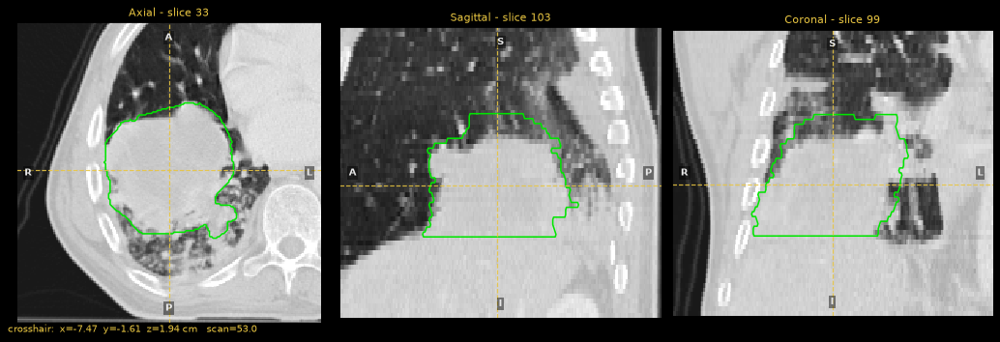

Quickstart
==========

This page takes about ten minutes. It loads a CT scan and its tumor contour
from DICOM, looks at them, pulls out the voxel data as NumPy arrays, computes a
few radiomics features and writes the results to disk. Every command runs on
data that ships inside the ``pycerr`` wheel, so no download is needed.

Install
-------

pyCERR supports Python 3.9 to 3.13. Install it into a virtual environment:

.. code-block:: bash

   python -m venv .venv
   source .venv/bin/activate          # Windows: .venv\Scripts\activate
   pip install pycerr

The core install covers the Python API and the Jupyter viewer. The desktop
viewer, napari viewer and ANTs registration are optional extras:

.. code-block:: bash

   pip install "pycerr[viewer]"       # PyQt5 desktop viewer, ROE and IMRTP GUIs
   pip install "pycerr[napari]"       # napari 2D/3D viewer
   pip install "pycerr[ants]"         # ANTs registration

Load a DICOM directory
----------------------

All data for a patient lives in one :class:`~cerr.plan_container.PlanC`
object. :func:`~cerr.plan_container.loadDcmDir` walks a directory, reads every
DICOM file it finds and sorts them into scans, structures, doses and plans.

.. code-block:: python

   import os
   from cerr import datasets
   from cerr import plan_container as pc

   dcmDir = os.path.join(os.path.dirname(datasets.__file__),
                         'radiomics_phantom_dicom', 'pat_1')
   planC = pc.loadDcmDir(dcmDir)

   print(len(planC.scan), len(planC.structure), len(planC.dose))

.. code-block:: text

   1 1 0

The sample is a lung CT with one RTSTRUCT contour and no dose. To use your own
data, point ``dcmDir`` at your DICOM folder.

Look at what was loaded
-----------------------

Each entry of ``planC.scan`` is a :class:`~cerr.dataclasses.scan.Scan`, and
each entry of ``planC.structure`` is a
:class:`~cerr.dataclasses.structure.Structure`. Indices start at 0.

.. code-block:: python

   scan3M = planC.scan[0].getScanArray()
   print(scan3M.shape)                           # (rows, columns, slices)
   print(planC.scan[0].getScanSpacing())         # dx, dy, dz in cm
   print(planC.scan[0].getScanOrientation())
   print([s.structureName for s in planC.structure])

.. code-block:: text

   (201, 204, 60)
   [0.0977 0.0977 0.3   ]
   LPI
   ['GTV-1']

.. note::

   pyCERR reports lengths in **centimetres**, and arrays are indexed
   ``[row, column, slice]``. See :doc:`user_guide/planc` for the coordinate
   conventions.

View the scan and contour
-------------------------

In Jupyter, JupyterLab, VS Code or Colab, the notebook viewer shows linked
axial, sagittal and coronal views with sliders for slice, window and
structure visibility:

.. code-block:: python

   from cerr.viewer import pycerr_nbviewer

   viewer = pycerr_nbviewer.showNB(planC, scan_nums=[0], struct_nums=[0])
   viewer.goto_structure(0)                     # centre the views on GTV-1

   The notebook viewer centred on ``GTV-1``. ``viewer.save_screenshot(path)``
   writes this figure to a file.

From a plain Python session, the desktop viewer does the same job and adds
contouring, registration QA and DVH tools (needs the ``viewer`` extra):

.. code-block:: python

   from cerr.viewer.pycerr_gui import show
   v = show(planC)

Get a structure as a binary mask
--------------------------------

Contours are stored as polygons. :func:`~cerr.contour.rasterseg.getStrMask`
rasterizes them to a boolean array on the grid of the scan the structure
belongs to, so the mask indexes straight into the scan array.

.. code-block:: python

   import numpy as np
   from cerr.contour import rasterseg as rs

   mask3M = rs.getStrMask(0, planC)
   voxelVolCc = np.prod(planC.scan[0].getScanSpacing())

   print(mask3M.shape, mask3M.dtype)
   print(mask3M.sum() * voxelVolCc)              # structure volume in cc
   print(scan3M[mask3M].mean())                  # mean HU inside the GTV

.. code-block:: text

   (201, 204, 60) bool
   358.68145187152777
   -46.88272

Compute radiomics features
--------------------------

:func:`~cerr.radiomics.ibsi1.computeScalarFeatures` reads a JSON settings file
that fixes the resampling, discretization and feature classes, and returns a
flat dictionary of features. A sample settings file ships with pyCERR.

.. code-block:: python

   from cerr.radiomics import ibsi1

   settingsFile = os.path.join(os.path.dirname(datasets.__file__),
                               'radiomics_settings', 'original_settings.json')
   featDict, diagDict = ibsi1.computeScalarFeatures(0, 0, settingsFile, planC)

   print(len(featDict))
   print(featDict['original_firstOrder_mean'])
   print(featDict['original_firstOrder_entropy'])

.. code-block:: text

   293
   -46.636656557042805
   6.047972468177557

The mean differs slightly from the raw mask mean above because the settings
file resamples the scan to 1 mm in-plane and keeps only voxels between -1000
and 300 HU. :doc:`user_guide/radiomics` explains each setting.

Save your work
--------------

.. code-block:: python

   # NIfTI, for use in other tools
   planC.scan[0].saveNii('scan.nii.gz')
   planC.structure[0].saveNii('gtv.nii.gz', planC)

   # The plan container itself, as HDF5
   pc.saveToH5(planC, 'planC.h5')
   planC = pc.loadFromH5('planC.h5')

   # Features, one row per call
   ibsi1.writeFeaturesToFile(featDict, 'features.csv')

:func:`~cerr.plan_container.saveToH5` writes the whole container by default.
To write a subset, pass index lists such as ``scanNumV=[0]``.

Where to go next
----------------

* :doc:`tutorials/end_to_end` chains import, structure operations, dose,
  DVH, an outcome model and radiomics into one workflow.
* :doc:`user_guide/planc` describes the data model and coordinate systems.
* The feature guides cover :doc:`user_guide/dvh`, :doc:`user_guide/roe`,
  :doc:`user_guide/radiomics`, :doc:`user_guide/registration` and
  :doc:`user_guide/segmentation`.
* More notebooks are at https://github.com/cerr/pyCERR-Notebooks.
