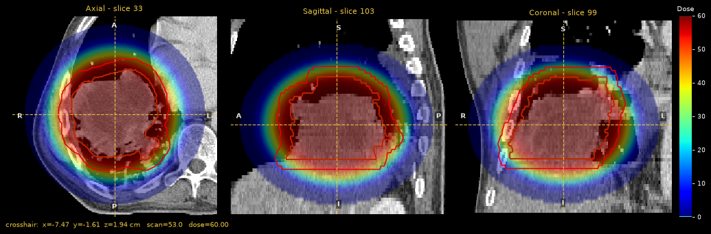

End-to-end workflow
===================

This tutorial runs one patient through a typical radiotherapy research
pipeline: import, derive structures, attach a dose, review it, compute
dose-volume metrics, evaluate an outcome model, extract radiomics features and
save the results. Each step links to the guide page that covers it in depth.

It uses the lung CT phantom that ships with pyCERR. That dataset has no
RTDOSE, so step 3 builds a **synthetic dose** to stand in for one. With
clinical data you would skip step 3, because
:func:`~cerr.plan_container.loadDcmDir` imports RTDOSE along with the scan.

.. contents:: Steps
   :local:
   :depth: 1

1. Import
---------

.. code-block:: python

   import json
   import os

   import numpy as np

   from cerr import datasets, dvh
   from cerr import plan_container as pc
   from cerr.contour import rasterseg as rs
   from cerr.dataclasses import structure as cerrStr
   from cerr.radiomics import ibsi1
   from cerr.roe import dosimetric_models as roe

   dataDir = os.path.dirname(datasets.__file__)
   planC = pc.loadDcmDir(os.path.join(dataDir, 'radiomics_phantom_dicom', 'pat_1'))

``planC`` now holds one CT scan (``planC.scan[0]``) and one structure,
``GTV-1`` (``planC.structure[0]``). See :doc:`../user_guide/planc`.

2. Derive structures
--------------------

Outcome models need an organ at risk. The phantom has only a tumor contour, so
this tutorial makes a 1 cm shell of tissue around the GTV and treats it as the
organ at risk.

.. code-block:: python

   planC = cerrStr.getSurfaceExpand(0, 1.0, planC)        # GTV + 1 cm  -> structure 1
   planC = cerrStr.structDiff(1, 0, planC, 'Ring_1cm')    # shell only  -> structure 2

   print([s.structureName for s in planC.structure])

.. code-block:: text

   ['GTV-1', 'GTV-1_expand_1.0 cm', 'Ring_1cm']

Each operation appends a new structure and returns the updated ``planC``. See
:doc:`../user_guide/segmentation`.

3. Attach a dose
----------------

Any NumPy array on a known grid can become a dose with
:func:`~cerr.plan_container.importDoseArray`. Here the array is a flat-topped
blob centred on the GTV, peaking at 60 Gy.

.. code-block:: python

   xV, yV, zV = planC.scan[0].getScanXYZVals()            # cm, virtual coordinates
   rowV, colV, slcV = np.where(rs.getStrMask(0, planC))
   x0, y0, z0 = xV[colV].mean(), yV[rowV].mean(), zV[slcV].mean()

   xM, yM, zM = np.meshgrid(xV, yV, zV)                   # shape (rows, cols, slices)
   r2 = ((xM - x0) / 6.5) ** 2 + ((yM - y0) / 6.5) ** 2 + ((zM - z0) / 5.5) ** 2
   dose3M = 60.0 * np.exp(-r2 ** 4)

   planC = pc.importDoseArray(dose3M, xV, yV, zV, planC, 0,
                              {'fractionGroupID': 'Synthetic', 'doseUnits': 'GY'})

.. warning::

   This dose is for illustration. It is not a treatment plan, and the numbers
   that follow have no clinical meaning.

4. Review
---------

.. code-block:: python

   from cerr.viewer import pycerr_nbviewer

   viewer = pycerr_nbviewer.showNB(planC, scan_nums=[0], struct_nums=[0, 2],
                                   dose_nums=[0])
   viewer.goto_structure(0)

   Dose colorwash over the CT with ``GTV-1`` and ``Ring_1cm``.

5. Dose-volume metrics
----------------------

.. code-block:: python

   for structNum in (0, 2):
       dosesV, volsV, isErr = dvh.getDVH(structNum, 0, planC)
       doseBinsV, volsHistV = dvh.doseHist(dosesV, volsV, 0.05)
       print('%-10s vol %.1f cc  mean %.1f  D95 %.1f  V50 %.1f%%' % (
           planC.structure[structNum].structureName, volsV.sum(),
           dvh.meanDose(doseBinsV, volsHistV),
           dvh.Dx(doseBinsV, volsHistV, 95, 1),
           100 * dvh.Vx(doseBinsV, volsHistV, 50, 1)))

.. code-block:: text

   GTV-1      vol 358.7 cc  mean 57.9  D95 51.2  V50 95.9%
   Ring_1cm   vol 356.6 cc  mean 45.0  D95 17.4  V50 45.0%

See :doc:`../user_guide/dvh`.

6. Outcome model
----------------

Built-in models name the structure they expect. The esophagitis model below
expects ``Esophagus``, so the model definition is loaded as a dictionary and
pointed at ``Ring_1cm`` instead. The model also needs one clinical predictor.

.. code-block:: python

   with open(roe.mapModelToFile('Esophagitis (Huang)')) as f:
       model = json.load(f)

   structs = model['parameters']['structures']
   model['parameters']['structures'] = {'Ring_1cm': structs['Esophagus']}
   model['parameters']['concurrentChemo']['val'] = 1

   ntcp = roe.run(model, 0, planC, fNumIn=30)             # plan given in 30 fractions
   print('NTCP %.3f' % ntcp)

.. code-block:: text

   NTCP 0.820

See :doc:`../user_guide/roe`.

7. Radiomics
------------

.. code-block:: python

   settingsFile = os.path.join(dataDir, 'radiomics_settings', 'original_settings.json')
   featDict, diagDict = ibsi1.computeScalarFeatures(0, 0, settingsFile, planC)
   print(len(featDict))

.. code-block:: text

   293

See :doc:`../user_guide/radiomics`.

8. Save
-------

.. code-block:: python

   pc.saveToH5(planC, 'phantom.h5')                       # everything in planC
   planC.structure[2].saveNii('ring.nii.gz', planC)
   ibsi1.writeFeaturesToFile(featDict, 'features.csv')

   planC2 = pc.loadFromH5('phantom.h5')
   print(len(planC2.scan), [s.structureName for s in planC2.structure], len(planC2.dose))

.. code-block:: text

   1 ['GTV-1', 'GTV-1_expand_1.0 cm', 'Ring_1cm'] 1

The script that produced the numbers and figure on this page is
``docs/_figure_scripts/tutorial_end_to_end.py``.
