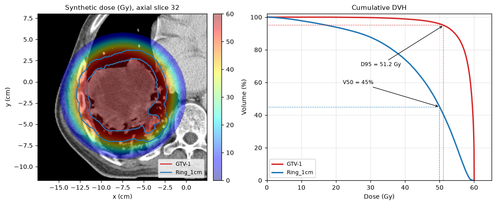
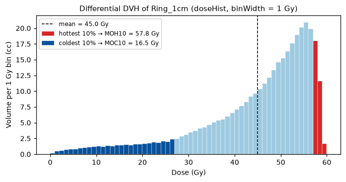

Dose-volume histograms and metrics
==================================

The :mod:`cerr.dvh` module turns a dose distribution and a structure into a
dose-volume histogram (DVH) and reduces it to the scalar metrics used in plan
evaluation and outcome modeling: mean and median dose, D\ :sub:`x`, V\ :sub:`x`, mean of
the hottest or coldest fraction, and generalized equivalent uniform dose.

The calculation has two steps. :func:`~cerr.dvh.getDVH` samples the dose at
every voxel of the structure. :func:`~cerr.dvh.doseHist` bins those samples
into a differential histogram. Every metric function then takes the histogram.

Prerequisites
-------------

A ``planC`` with at least one dose and one structure. The examples use the
bundled lung phantom with two structures (``GTV-1`` and a 1 cm shell around
it, ``Ring_1cm``) and a synthetic 60 Gy dose; the code that builds them is in
:doc:`../tutorials/end_to_end`. With clinical data, load the DICOM directory
that holds the CT, RTSTRUCT and RTDOSE files.

Minimal example
---------------

.. code-block:: python

   from cerr import dvh

   structNum, doseNum = 0, 0
   dosesV, volsV, isErr = dvh.getDVH(structNum, doseNum, planC)
   doseBinsV, volsHistV = dvh.doseHist(dosesV, volsV, 0.05)   # 0.05 Gy bins

   print(dvh.meanDose(doseBinsV, volsHistV))
   print(dvh.Dx(doseBinsV, volsHistV, 95, 1))                 # D95%, Gy
   print(dvh.Vx(doseBinsV, volsHistV, 50, 1))                 # V50Gy, fraction

.. code-block:: text

   57.91
   51.18
   0.959

Walkthrough
-----------

Sample the dose
~~~~~~~~~~~~~~~

.. code-block:: python

   dosesV, volsV, isErr = dvh.getDVH(structNum, doseNum, planC)

``dosesV`` holds one dose value per structure voxel and ``volsV`` the volume
of each voxel in cc, so ``volsV.sum()`` is the structure volume. The dose is
interpolated at the voxel centres of the structure's scan, which means the
dose grid and the scan grid need not match. ``isErr`` is 1 when the structure
has no voxels.

Bin into a histogram
~~~~~~~~~~~~~~~~~~~~

.. code-block:: python

   doseBinsV, volsHistV = dvh.doseHist(dosesV, volsV, binWidth)

``doseBinsV`` are the bin centres and ``volsHistV`` the volume in each bin (a
differential DVH). A narrow ``binWidth`` such as 0.05 Gy keeps the metrics
close to their voxel-wise values. To plot the familiar cumulative curve,
accumulate from the high-dose end:

.. code-block:: python

   import matplotlib.pyplot as plt
   import numpy as np

   cumVolsV = np.cumsum(volsHistV[::-1])[::-1] / volsHistV.sum() * 100
   plt.plot(doseBinsV, cumVolsV)
   plt.xlabel('Dose (Gy)')
   plt.ylabel('Volume (%)')

   Left: the synthetic dose with ``GTV-1`` and ``Ring_1cm``. Right: their
   cumulative DVHs, with D\ :sub:`95` of the GTV and V\ :sub:`50` of the ring
   read off the curves.

Compute metrics
~~~~~~~~~~~~~~~

.. code-block:: python

   for structNum in (0, 2):
       dosesV, volsV, isErr = dvh.getDVH(structNum, doseNum, planC)
       doseBinsV, volsHistV = dvh.doseHist(dosesV, volsV, 0.05)
       print(planC.structure[structNum].structureName, round(volsV.sum(), 1), 'cc')
       print('  mean', dvh.meanDose(doseBinsV, volsHistV),
             ' min', dvh.minDose(doseBinsV, volsHistV),
             ' max', dvh.maxDose(doseBinsV, volsHistV),
             ' median', dvh.medianDose(doseBinsV, volsHistV))
       print('  D95', dvh.Dx(doseBinsV, volsHistV, 95, 1),
             ' D2', dvh.Dx(doseBinsV, volsHistV, 2, 1))
       print('  V50', dvh.Vx(doseBinsV, volsHistV, 50, 1),
             ' V50 cc', dvh.Vx(doseBinsV, volsHistV, 50, 0))
       print('  MOH5', dvh.MOHx(doseBinsV, volsHistV, 5),
             ' MOC5', dvh.MOCx(doseBinsV, volsHistV, 5))

.. code-block:: text

   GTV-1 358.7 cc
     mean 57.91  min 13.28  max 60.02  median 59.33
     D95 51.18  D2 59.98
     V50 0.959  V50 cc 344.0
     MOH5 59.98  MOC5 44.13
   Ring_1cm 356.6 cc
     mean 44.96  min 0.48  max 59.73  median 48.77
     D95 17.38  D2 58.43
     V50 0.450  V50 cc 160.5
     MOH5 58.34  MOC5 10.40

Metric reference
----------------

All functions take ``(doseBinsV, volsHistV, ...)`` as returned by
:func:`~cerr.dvh.doseHist`. Doses are in the units of the dose object.

.. list-table::
   :header-rows: 1
   :widths: 26 74

   * - Function
     - Returns
   * - :func:`~cerr.dvh.meanDose`
     - Volume-weighted mean dose.
   * - :func:`~cerr.dvh.minDose`, :func:`~cerr.dvh.maxDose`
     - Lowest and highest dose bin that contains volume.
   * - :func:`~cerr.dvh.medianDose`
     - Volume-weighted median: the dose that half of the structure receives
       at least, equal to D\ :sub:`50%`.
   * - :func:`Dx(…, volCutoff, volumeType) <cerr.dvh.Dx>`
     - Minimum dose to the hottest ``volCutoff`` of the structure.
       ``volumeType=1`` (default) reads ``volCutoff`` as a percentage,
       ``volumeType=0`` as cc.
   * - :func:`Vx(…, doseCutoff, volumeType) <cerr.dvh.Vx>`
     - Volume receiving at least ``doseCutoff``. ``volumeType=0`` (default)
       returns cc, ``volumeType=1`` returns a fraction between 0 and 1.
   * - :func:`MOHx(…, percent) <cerr.dvh.MOHx>`
     - Mean dose of the hottest ``percent`` % of the volume.
   * - :func:`MOCx(…, percent) <cerr.dvh.MOCx>`
     - Mean dose of the coldest ``percent`` % of the volume.
   * - :func:`eud(…, exponent) <cerr.dvh.eud>`
     - Generalized equivalent uniform dose,
       :math:`\left(\sum_i v_i D_i^{a}\right)^{1/a}` with :math:`v_i` the
       fractional volume of bin *i* and :math:`a` = ``exponent``.

.. note::

   The defaults of ``volumeType`` differ: :func:`~cerr.dvh.Dx` assumes a
   percentage, :func:`~cerr.dvh.Vx` returns absolute cc. Pass the argument
   explicitly to avoid surprises.

Mean of hottest and coldest volume
~~~~~~~~~~~~~~~~~~~~~~~~~~~~~~~~~~

MOH\ :sub:`x` and MOC\ :sub:`x` summarize the tails of the distribution with
less sensitivity to single voxels than the minimum and maximum dose.

   Differential DVH of ``Ring_1cm``. MOH\ :sub:`10` averages the red bins and
   MOC\ :sub:`10` the dark blue bins.

Generalized EUD
~~~~~~~~~~~~~~~

The exponent sets which part of the DVH dominates. Large negative values
track the cold spots, which suits tumors; large positive values track the hot
spots, which suits serial organs; ``exponent=1`` gives the mean dose.

.. code-block:: python

   dvh.eud(doseBinsV, volsHistV, -10)    # GTV-1: 34.2 Gy, pulled down by cold voxels
   dvh.eud(doseBinsV, volsHistV, 8)      # GTV-1: 58.5 Gy

Fractionation
-------------

To compare plans delivered with different fractionation, convert the dose
with the linear-quadratic model before computing metrics:

.. code-block:: python

   from cerr.dataclasses.dose import fractionSizeCorrect, fractionNumCorrect

   # 60 Gy in 30 fractions, expressed as the equivalent dose in 2 Gy fractions
   eqd2BinsV = fractionSizeCorrect(doseBinsV, stdFrxSize=2, abRatio=3, inputFrxSize=2.0)

   # ... or as the equivalent total dose if given in 35 fractions
   eq35BinsV = fractionNumCorrect(doseBinsV, stdFrxNum=35, abRatio=3, inputFrxNum=30)

The corrected bins pair with the original ``volsHistV``. Outcome models in
:doc:`roe` apply these corrections for you.

Other dose tools
----------------

* :func:`cerr.dataclasses.dose.sum` adds several doses on a common grid, with
  optional fractionation correction.
* :mod:`cerr.gamma` compares two doses with the 3-D gamma index; see
  :func:`~cerr.gamma.gammaDose3dForDoses` and
  :func:`~cerr.gamma.gammaPassRate`.
* The viewers plot DVHs interactively. In the notebook viewer,
  ``viewer.compute_dvh()`` returns the curves and ``viewer.export_dvh(path)``
  writes them to CSV.

See also
--------

* :doc:`roe` uses these metrics as predictors in NTCP and TCP models.
* API reference: :mod:`cerr.dvh`.
* Figure script: ``docs/_figure_scripts/dvh.py``.
