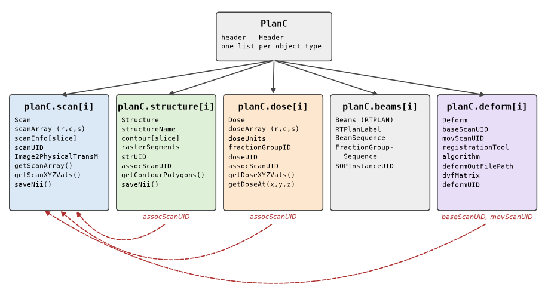
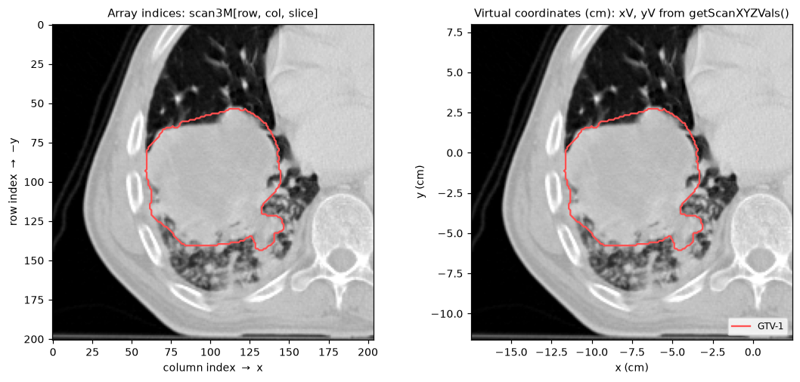

The planC data model
====================

pyCERR keeps everything known about one patient in a single object, the plan
container, conventionally named ``planC``. Scans, segmentations, dose
distributions, treatment plans and registrations sit side by side, with unique
identifiers recording which belongs to which. Every pyCERR function takes a
``planC`` and most return an updated one, so understanding this object is the
key to the rest of the library.

   :class:`~cerr.plan_container.PlanC` holds one list per object type. Dashed
   arrows are UID references: a structure or dose points at the scan it was
   drawn or calculated on, and a deformation points at its fixed and moving
   scans.

The container
-------------

:class:`~cerr.plan_container.PlanC` is a dataclass with six attributes.

.. list-table::
   :header-rows: 1
   :widths: 20 30 50

   * - Attribute
     - Element type
     - Holds
   * - ``header``
     - :class:`~cerr.dataclasses.header.Header`
     - pyCERR version, creation date and last-saved date.
   * - ``scan``
     - list of :class:`~cerr.dataclasses.scan.Scan`
     - CT, MR, PET, US and NM volumes, plus derived images such as texture
       maps and warped scans.
   * - ``structure``
     - list of :class:`~cerr.dataclasses.structure.Structure`
     - Segmentations from RTSTRUCT or SEG files, NIfTI masks or NumPy arrays.
   * - ``dose``
     - list of :class:`~cerr.dataclasses.dose.Dose`
     - RTDOSE grids and doses imported from arrays.
   * - ``beams``
     - list of :class:`~cerr.dataclasses.beams.Beams`
     - RTPLAN metadata: beam and fraction-group sequences.
   * - ``deform``
     - list of :class:`~cerr.dataclasses.deform.Deform`
     - Rigid and deformable registrations between two scans.

Objects are addressed by their position in the list, starting at 0. Function
arguments named ``scanNum``, ``structNum`` and ``doseNum`` are these indices.

.. code-block:: python

   import os
   from cerr import datasets
   from cerr import plan_container as pc

   dcmDir = os.path.join(os.path.dirname(datasets.__file__),
                         'radiomics_phantom_dicom', 'pat_1')
   planC = pc.loadDcmDir(dcmDir)

   print(planC.header)
   print(len(planC.scan), len(planC.structure), len(planC.dose),
         len(planC.beams), len(planC.deform))

.. code-block:: text

   Header(dateCreated='20261009', dateLastSaved='', writer='', version='2.3.2')
   1 1 0 0 0

Building a planC
----------------

.. list-table::
   :header-rows: 1
   :widths: 28 72

   * - Source
     - Function
   * - DICOM directory or file list
     - :func:`~cerr.plan_container.loadDcmDir`
   * - NIfTI scan
     - :func:`~cerr.plan_container.loadNiiScan`
   * - NIfTI mask or label map
     - :func:`~cerr.plan_container.loadNiiStructure`
   * - NIfTI dose
     - :func:`~cerr.plan_container.loadNiiDose`
   * - NumPy arrays
     - :func:`~cerr.plan_container.importScanArray`,
       :func:`~cerr.plan_container.importStructureMask`,
       :func:`~cerr.plan_container.importDoseArray`
   * - DICOM registration object
     - :func:`~cerr.plan_container.loadDcmReg`
   * - Saved planC (HDF5)
     - :func:`~cerr.plan_container.loadFromH5`

The loaders that start a new container (``loadDcmDir``, ``loadNiiScan``,
``loadFromH5``) accept ``initplanC`` to append to an existing one instead.
That is how two studies of one patient end up in the same ``planC``:

.. code-block:: python

   planC = pc.loadDcmDir('/data/pt1/planning_ct')
   planC = pc.loadDcmDir('/data/pt1/followup_mr', initplanC=planC)

Scans
-----

A :class:`~cerr.dataclasses.scan.Scan` stores the voxel array and one
``scanInfo`` record per slice holding the geometry and DICOM metadata of that
slice.

.. code-block:: python

   scanObj = planC.scan[0]

   scan3M = scanObj.getScanArray()          # intensities, e.g. HU for CT
   print(scan3M.shape)                      # (201, 204, 60) = rows, cols, slices
   print(scanObj.getScanSpacing())          # [0.0977 0.0977 0.3] cm
   print(scanObj.scanInfo[0].imageType)     # 'CT SCAN'
   print(scanObj.scanInfo[0].zValue)        # -7.66, z of the first slice in cm

Use :meth:`~cerr.dataclasses.scan.Scan.getScanArray` in preference to the raw
``scanArray`` attribute: it applies the stored CT offset, so the values come
back in Hounsfield units. PET scans are converted to SUV at import; choose
the normalization with ``opts={'suvType': ...}`` in
:func:`~cerr.plan_container.loadDcmDir`.

Structures
----------

A :class:`~cerr.dataclasses.structure.Structure` stores the contour polygons
for each slice and a compact run-length form of the filled mask
(``rasterSegments``). The full 3-D mask is built when you ask for it:

.. code-block:: python

   from cerr.contour import rasterseg as rs

   structObj = planC.structure[0]
   print(structObj.structureName)                       # 'GTV-1'
   print(structObj.structureFileFormat)                 # 'RTSTRUCT'
   print(structObj.getStructureAssociatedScan(planC))   # 0

   mask3M = rs.getStrMask(0, planC)                     # bool, same shape as the scan

To find a structure by name rather than by index:

.. code-block:: python

   from cerr.dataclasses import structure as cerrStr

   names = [s.structureName for s in planC.structure]
   structNum = cerrStr.getMatchingIndex('GTV-1', names, 'exact')[0]

Dose
----

A :class:`~cerr.dataclasses.dose.Dose` has its own grid, which usually
differs from the scan grid. Read the grid with
:meth:`~cerr.dataclasses.dose.Dose.getDoseXYZVals` and sample the dose at
arbitrary points with :meth:`~cerr.dataclasses.dose.Dose.getDoseAt`, which
interpolates:

.. code-block:: python

   doseObj = planC.dose[0]
   dose3M = doseObj.doseArray                   # (rows, cols, slices), in doseUnits
   xDoseV, yDoseV, zDoseV = doseObj.getDoseXYZVals()
   print(doseObj.getDoseAt(-7.5, -1.6, 1.6))    # dose at x, y, z in cm

How objects are linked
----------------------

Each object carries a unique identifier (``scanUID``, ``strUID``, ``doseUID``,
``deformUID``). Associations are stored as UIDs, never as list positions, so
they survive when objects are added, removed or saved to a file.

.. code-block:: python

   from cerr.dataclasses import scan as scn

   assocScanUID = planC.structure[0].assocScanUID
   scanNum = scn.getScanNumFromUID(assocScanUID, planC)

The same pattern applies to ``planC.dose[i].assocScanUID`` and to
``baseScanUID`` and ``movScanUID`` on a deformation.

.. _coordinates:

Coordinate systems
------------------

pyCERR uses three ways of locating a voxel.

**Array indices.** Volumes are indexed ``[row, column, slice]``.

**Virtual coordinates.** pyCERR's own physical frame, in **centimetres**.
:meth:`~cerr.dataclasses.scan.Scan.getScanXYZVals` returns three vectors:

* ``xV`` has one value per **column** and increases with the column index.
* ``yV`` has one value per **row** and *decreases* with the row index, so the
  top row of the image has the largest y.
* ``zV`` has one value per **slice**.

Contours, dose grids, structure masks and deformation vectors are all
expressed in this frame, which is why a dose can be sampled at a structure's
voxels without the two sharing a grid.

**DICOM patient coordinates.** The LPS frame of the source files, in
millimetres. Each scan keeps the matrix ``cerrToDcmTransM`` that maps virtual
``(x, y, z)`` to DICOM, and DICOM export applies it for you.

   One axial slice of the phantom, addressed by array indices (left) and by
   virtual coordinates (right). The y axis runs opposite to the row index.

The voxel at ``[row, col, slc]`` therefore sits at
``(xV[col], yV[row], zV[slc])``:

.. code-block:: python

   import numpy as np

   xV, yV, zV = planC.scan[0].getScanXYZVals()
   print(xV[[0, -1]], yV[[0, -1]], zV[[0, -1]])

   # Coordinate grids with the same shape as the scan array
   xM, yM, zM = np.meshgrid(xV, yV, zV)

   # Centre of mass of a structure, in cm
   rowV, colV, slcV = np.where(mask3M)
   print(xV[colV].mean(), yV[rowV].mean(), zV[slcV].mean())

.. code-block:: text

   [-17.4395   2.3936] [  7.9626 -11.5774] [-7.66 10.04]
   -7.474 -1.612 1.640

.. tip::

   To plot a slice in virtual coordinates with matplotlib, pass
   ``extent=[xV[0], xV[-1], yV[-1], yV[0]]`` to ``imshow``. The contour
   overlay is then ``plt.contour(xV, yV, mask3M[:, :, slc])``.

Saving and exporting
--------------------

.. list-table::
   :header-rows: 1
   :widths: 28 72

   * - Target
     - Function
   * - HDF5 (round-trips a planC)
     - :func:`~cerr.plan_container.saveToH5`. Writes everything by default;
       pass ``scanNumV``, ``structNumV``, ``doseNumV`` or ``deformNumV`` to
       write a subset.
   * - NIfTI
     - :meth:`Scan.saveNii <cerr.dataclasses.scan.Scan.saveNii>`,
       :meth:`Structure.saveNii <cerr.dataclasses.structure.Structure.saveNii>`,
       :meth:`Dose.saveNii <cerr.dataclasses.dose.Dose.saveNii>`,
       :func:`~cerr.plan_container.saveNiiStructure` for label maps
   * - DICOM
     - The :mod:`cerr.dcm_export` package, for example
       :func:`cerr.dcm_export.rtstruct_iod.create`
   * - SimpleITK
     - ``getSitkImage()`` on scans, structures and doses

See also
--------

* :doc:`../quickstart` for a first session with ``planC``.
* API reference: :mod:`cerr.plan_container` and :doc:`../cerr.dataclasses`.
