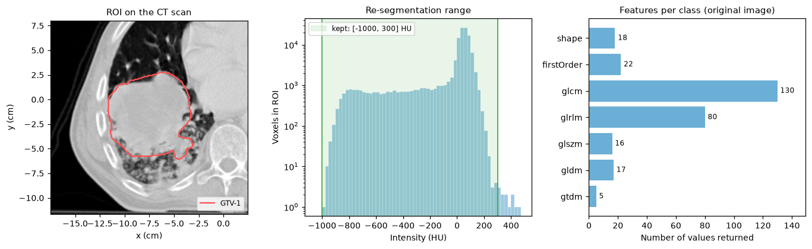
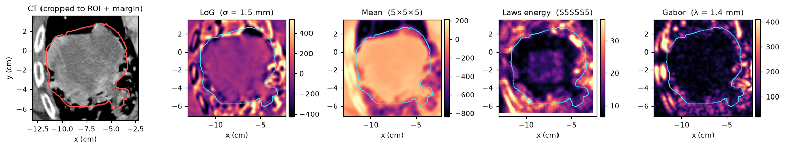

Radiomics
=========

The :mod:`cerr.radiomics` package extracts quantitative descriptors of a
region of interest: its shape, its intensity distribution and its texture.
The implementation follows the Image Biomarker Standardisation Initiative
(IBSI) and is tested against the IBSI reference values on every commit.

There are two entry points:

* :func:`~cerr.radiomics.ibsi1.computeScalarFeatures` returns a dictionary of
  scalar features for one structure (IBSI chapter 1).
* :func:`~cerr.radiomics.texture_utils.generateTextureMapFromPlanC` applies a
  convolutional filter and stores the response map as a new scan (IBSI
  chapter 2).

Both are configured by a JSON settings file, which makes an analysis
reproducible: the file records every preprocessing choice.

Prerequisites
-------------

A ``planC`` with a scan and a structure on it. The examples use the bundled
lung CT phantom and its ``GTV-1`` contour (see :doc:`../quickstart`), and the
sample settings files in ``cerr/datasets``.

Minimal example
---------------

.. code-block:: python

   import os
   from cerr import datasets
   from cerr.radiomics import ibsi1

   scanNum, structNum = 0, 0
   settingsFile = os.path.join(os.path.dirname(datasets.__file__),
                               'radiomics_settings', 'original_settings.json')

   featDict, diagDict = ibsi1.computeScalarFeatures(scanNum, structNum,
                                                    settingsFile, planC)
   print(len(featDict))
   print(featDict['original_firstOrder_mean'])

.. code-block:: text

   293
   -46.636656557042805

Scalar features
---------------

What comes back
~~~~~~~~~~~~~~~

``featDict`` is a flat dictionary. Keys are built as
``<imageType>_<featureClass>_<featureName>``, with a suffix for texture
features that records the directionality and how directions were aggregated:

.. code-block:: text

   original_shape_sphericity
   original_firstOrder_entropy
   original_glcm_jointEntropy_3D_avg
   original_glszm_smallAreaEmphasis_3D

Shape features are in millimetres: ``original_shape_volume`` is 357,627
mm\ :sup:`3` for this structure, or 357.6 cc.

``diagDict`` reports what preprocessing did to the region, which is worth
checking before trusting the features:

.. code-block:: python

   print(diagDict)

.. code-block:: text

   {'numVoxelsOrig': 125256, 'numVoxelsInterpReseg': 119183,
    'meanIntensityInterpReseg': -46.64, 'maxIntensityInterpReseg': 293.24,
    'minIntensityInterpReseg': -957.65}

Here the structure had 125,256 voxels on the original grid and 119,183 after
resampling and intensity re-segmentation.

   Left: ``GTV-1`` on the CT. Centre: intensities inside it, with the range
   kept by ``minSegThreshold`` and ``maxSegThreshold``. Right: number of values
   returned per feature class by ``original_settings.json``.

Feature classes
~~~~~~~~~~~~~~~

.. list-table::
   :header-rows: 1
   :widths: 16 24 60

   * - Key
     - Class
     - Describes
   * - ``shape``
     - Morphology
     - Volume, surface area, axis lengths, sphericity, compactness.
   * - ``firstOrder``
     - Intensity statistics and histogram
     - Mean, percentiles, skewness, kurtosis, entropy, energy.
   * - ``glcm``
     - Grey level co-occurrence
     - How often pairs of grey levels occur next to each other.
   * - ``glrlm``
     - Grey level run length
     - Lengths of runs of equal grey level along a direction.
   * - ``glszm``
     - Grey level size zone
     - Sizes of connected zones of equal grey level.
   * - ``gldm``
     - Neighbouring grey level dependence
     - How many neighbours of a voxel share its grey level.
   * - ``gtdm``
     - Neighbourhood grey tone difference
     - Difference between a voxel and the mean of its neighbourhood.

The GLCM and GLRLM are computed per direction. With ``"avgType":
"feature"`` each feature is reported as the mean, median, standard deviation,
minimum and maximum over directions, which is why those two classes return
the most values.

The settings file
~~~~~~~~~~~~~~~~~

.. code-block:: json

   {
     "structures": ["tumor"],
     "imageType": {"Original": {}},
     "settings": {
       "resample": {"resolutionXCm": 0.1, "resolutionYCm": 0.1, "resolutionZCm": 0,
                    "interpMethod": "sitkLinear", "inPlane": "yes"},
       "cropToMask": {"method": "expand", "size": [6, 6, 6]},
       "firstOrder": {"offsetForEnergy": 1000, "binWidthEntropy": 5},
       "texture": {"minSegThreshold": -1000, "maxSegThreshold": 300,
                   "minClipIntensity": -1000, "maxClipIntensity": 300,
                   "binwidth": 5, "directionality": "3D", "avgType": "feature",
                   "voxelOffset": 1, "patchRadiusVox": [1, 1, 1], "imgDiffThresh": 5}
     },
     "featureClass": {
       "shape": {"featureList": ["all"]},
       "firstOrder": {"featureList": ["all"]},
       "glcm": {"featureList": ["all"]},
       "glrlm": {"featureList": ["all"]},
       "glszm": {"featureList": ["all"]},
       "gldm": {"featureList": ["all"]},
       "gtdm": {"featureList": ["all"]}
     }
   }

.. list-table::
   :header-rows: 1
   :widths: 30 70

   * - Setting
     - Effect
   * - ``imageType``
     - Images to extract from. ``Original`` is the scan itself. Adding a
       filter (``LoG``, ``Mean``, ``Gabor``, ``Wavelets``, ...) with its
       parameters extracts the same features from the filtered image too.
   * - ``resample``
     - Voxel size in cm to interpolate to, and the SimpleITK interpolator.
       ``"inPlane": "yes"`` resamples x and y only and keeps the slice
       spacing, whatever ``resolutionZCm`` says.
   * - ``cropToMask``
     - Crops the scan to the structure plus a margin of ``size`` voxels
       before processing, which keeps filtering fast.
   * - ``texture.minSegThreshold``, ``maxSegThreshold``
     - Re-segmentation: voxels outside this intensity range are dropped from
       the region.
   * - ``texture.binwidth`` or ``binNum``
     - Grey-level discretization for texture matrices, as a fixed bin width
       or a fixed number of bins. Give one, not both.
   * - ``texture.minClipIntensity``, ``maxClipIntensity``
     - Intensity range the discretization spans.
   * - ``texture.directionality``
     - ``"3D"`` uses 13 directions through the volume, ``"2D"`` works slice
       by slice.
   * - ``texture.avgType``
     - ``"feature"`` computes features per direction and then aggregates;
       ``"texture"`` merges the matrices first.
   * - ``texture.voxelOffset``
     - Distance in voxels between the pair of voxels in the GLCM.
   * - ``texture.patchRadiusVox``, ``imgDiffThresh``
     - Neighbourhood radius for ``gtdm`` and ``gldm``, and the intensity
       difference below which neighbours count as dependent.
   * - ``firstOrder.binWidthEntropy``
     - Bin width for the histogram behind first-order entropy.
   * - ``featureClass``
     - Classes to compute. Remove a class to skip it.

Copy ``original_settings.json`` and edit it for your modality. The folder
``cerr/datasets/radiomics_settings/ibsi_settings`` holds the configurations
used for IBSI compliance testing, which are useful templates for other
discretization and interpolation choices.

.. important::

   Discretization and resampling settings change feature values. Report the
   settings file with any results, and use one file for a whole cohort.

Many patients
~~~~~~~~~~~~~

:func:`~cerr.radiomics.ibsi1.writeFeaturesToFile` appends one row per call to
a CSV file. Pass ``writeHeader=True`` only on the first call.

.. code-block:: python

   from cerr import plan_container as pc
   from cerr.dataclasses import structure as cerrStr

   csvFile = 'features.csv'
   for i, dcmDir in enumerate(patientDirs):
       planC = pc.loadDcmDir(dcmDir)
       names = [s.structureName for s in planC.structure]
       structNum = cerrStr.getMatchingIndex('GTV-1', names, 'exact')[0]
       scanNum = planC.structure[structNum].getStructureAssociatedScan(planC)
       featDict, _ = ibsi1.computeScalarFeatures(scanNum, structNum, settingsFile, planC)
       ibsi1.writeFeaturesToFile(featDict, csvFile, writeHeader=(i == 0))

The four patients in ``cerr/datasets/radiomics_phantom_dicom`` (``pat_1`` to
``pat_4``) each carry a ``GTV-1`` structure and make a ready test set for
this loop.

Texture maps
------------

A texture map is the voxel-wise response of a filter. It shows *where* in
the region a texture is present, and features can then be computed from the
map as from any other scan.

.. code-block:: python

   from cerr.radiomics import texture_utils

   filterFile = os.path.join(os.path.dirname(datasets.__file__),
                             'convolutional_filter_settings', 'LoG_filter.json')
   planC = texture_utils.generateTextureMapFromPlanC(planC, scanNum, structNum,
                                                     filterFile)

   texScanNum = len(planC.scan) - 1
   tex3M = planC.scan[texScanNum].getScanArray()
   print(planC.scan[texScanNum].scanInfo[0].imageType, tex3M.shape)

.. code-block:: text

   LoG (111, 112, 38)

The map is appended to ``planC.scan`` as a scan of its own, cropped to the
structure plus the ``cropToMask`` margin. It has its own grid, so read its
coordinates with ``planC.scan[texScanNum].getScanXYZVals()``. Because it is a
scan, the viewers display it and
:meth:`~cerr.dataclasses.scan.Scan.saveNii` exports it.

   The CT around ``GTV-1`` and four filter responses computed from the sample
   settings files. The structure outline is drawn in cyan.

Sample filter settings in ``cerr/datasets/convolutional_filter_settings``:

.. list-table::
   :header-rows: 1
   :widths: 38 62

   * - File
     - Filter
   * - ``mean_filter.json``
     - Local mean over a ``KernelSize`` neighbourhood.
   * - ``LoG_filter.json``
     - Laplacian of Gaussian; ``Sigma_mm`` sets the scale of blobs and edges
       it responds to.
   * - ``Rot_inv_laws_energy_filter.json``
     - Laws kernel (``Type``, e.g. ``S5S5S5``) followed by a local energy
       average, pooled over rotations.
   * - ``gabor_filter.json``
     - Gabor filter of given wavelength and orientations, aggregated over
       orientations and planes.

Other filter types accepted in ``imageType`` are ``Sobel``, ``Laws``,
``RotationInvariantLaws``, ``LawsEnergy``, ``Gabor3d``, ``Wavelets`` and
``RotationInvariantWavelets``. The IBSI chapter 2 settings files under
``radiomics_settings/ibsi_settings`` give working parameter sets for each.

To apply a filter to arrays without a ``planC``, call
:func:`~cerr.radiomics.texture_utils.processImage` directly.

See also
--------

* IBSI reference manual: https://ibsi.readthedocs.io
* Tests against IBSI reference values: ``tests/test_ibsi1_features.py``,
  ``tests/test_ibsi2_filters.py``.
* API reference: :doc:`../cerr.radiomics`.
* Figure script: ``docs/_figure_scripts/radiomics.py``.
