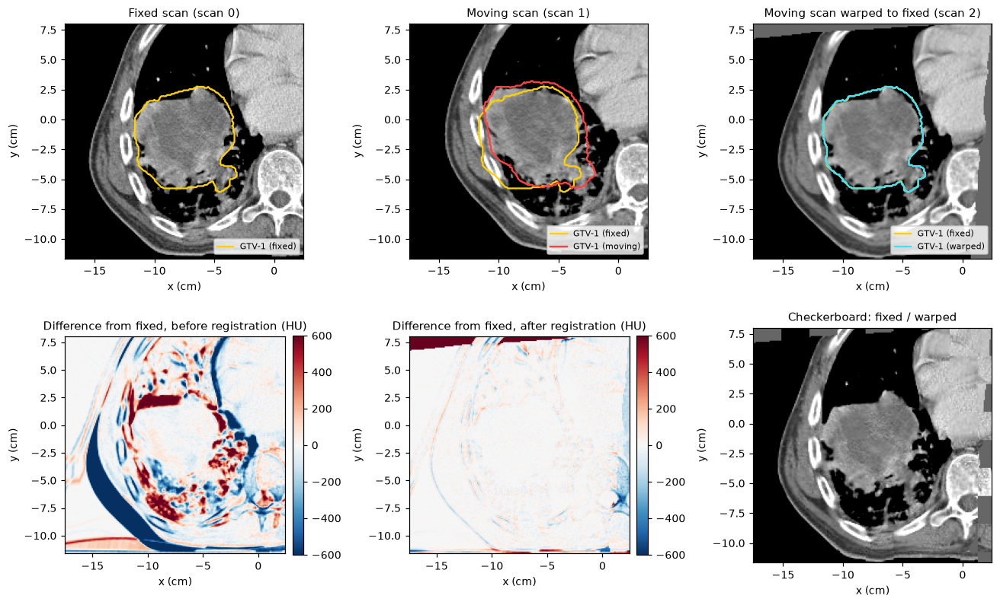

Image registration
==================

The :mod:`cerr.registration` package aligns one scan to another and carries
structures and dose across with the resulting transformation. It drives two
external engines, `plastimatch <https://plastimatch.org>`_ and
`ANTs <https://github.com/ANTsX/ANTsPy>`_, and stores the result in
``planC.deform`` so that later steps can reuse it.

Typical uses are propagating contours from a planning scan to a follow-up
scan, mapping dose between scans for accumulation, and aligning multi-modal
studies of one patient.

Terms
-----

* The **fixed** (or base) scan stays put. Results are produced on its grid.
* The **moving** scan is warped to match it.
* A **deform object** (:class:`~cerr.dataclasses.deform.Deform`) records the
  two scans by UID, the tool and algorithm, and where the transformation is
  stored.

Prerequisites
-------------

.. list-table::
   :header-rows: 1
   :widths: 18 42 40

   * - Engine
     - Install
     - Functions
   * - ANTs
     - ``pip install "pycerr[ants]"``
     - :func:`~cerr.registration.ants_reg.registerScansAnts`,
       ``warpScanAnts``, ``warpStructuresAnts``, ``warpDoseAnts``
   * - plastimatch
     - Install plastimatch separately and make sure the ``plastimatch``
       command is on your ``PATH``.
     - :func:`~cerr.registration.register.registerScans`, ``warpScan``,
       ``warpStructures``, ``warpDose``, ``calcVectorField``, ``calcJacobian``

The ANTs functions are also importable from
:mod:`cerr.registration.register`, so one import covers both engines.

The two scans can sit in the same ``planC`` or in two different ones. The
examples below use ANTs and a single ``planC`` in which scan 0 is fixed and
scan 1 is moving. Because the bundled data has only one scan per patient, the
moving scan was made by warping the lung phantom with a known shift and a
smooth deformation; ``docs/_figure_scripts/registration.py`` has the code.

Minimal example
---------------

.. code-block:: python

   from cerr.registration import register

   baseScanNum, movScanNum = 0, 1
   planC = register.registerScansAnts(planC, baseScanNum, planC, movScanNum,
                                      transformSaveDir='/path/to/transforms')

   warpedScanNum = len(planC.scan) - 1      # moving scan resampled on the fixed grid
   deformS = planC.deform[-1]               # the transformation

Walkthrough
-----------

Register
~~~~~~~~

.. code-block:: python

   planC = register.registerScansAnts(
       planC, baseScanNum, planC, movScanNum,
       transformSaveDir='/path/to/transforms',
       typeOfTransform='antsRegistrationSyNQuick[s]')

   deformS = planC.deform[-1]
   print(len(planC.scan), len(planC.deform))
   print(deformS.registrationTool, deformS.algorithm)

.. code-block:: text

   3 1
   ants antsRegistrationSyNQuick[s]

The call appends two things to the fixed ``planC``: the warped moving scan
and a deform object. ``typeOfTransform`` is passed to ``ants.registration``;
common choices are ``'Rigid'``, ``'Affine'``, ``'SyN'`` and the
``antsRegistrationSyNQuick[s]`` preset, which runs rigid, affine and
deformable stages in turn. The transform files are written to
``transformSaveDir``. Keep that directory: the deform object refers to the
files by path.

Warp structures and dose
~~~~~~~~~~~~~~~~~~~~~~~~

Once a deform object exists, apply it to anything defined on the moving
scan:

.. code-block:: python

   movStructNum = 1
   planC = register.warpStructuresAnts(planC, baseScanNum, planC,
                                       [movStructNum], deformS)
   warpedStructNum = len(planC.structure) - 1

   planC = register.warpDoseAnts(planC, baseScanNum, planC, movDoseNum, deformS)

Warped objects are appended to the fixed ``planC`` and associated with the
fixed scan. A warped structure keeps the name of its source, so rename it if
both will be exported:

.. code-block:: python

   planC.structure[warpedStructNum].structureName = 'GTV-1 (warped)'

Check the result
~~~~~~~~~~~~~~~~

Always inspect a registration before using it. Overlay the warped scan on
the fixed scan, and where the same structure exists on both, compare the
warped contour with the reference one:

.. code-block:: python

   from cerr.contour import rasterseg as rs

   fixedMask3M = rs.getStrMask(0, planC)
   warpedMask3M = rs.getStrMask(warpedStructNum, planC)
   dice = 2.0 * (fixedMask3M & warpedMask3M).sum() / (fixedMask3M.sum() + warpedMask3M.sum())

For the example this gives a Dice coefficient of 0.996, up from 0.795 before
registration, and the root-mean-square intensity difference inside the body
falls from 330 HU to 73 HU.

   Top: fixed scan, moving scan and the moving scan after registration, with
   the fixed GTV in yellow. Bottom: intensity difference from the fixed scan
   before and after registration, and a checkerboard of fixed and warped
   scans, in which anatomy should continue smoothly across tile borders.

The desktop viewer has a registration QA tool with mirror-scope,
side-by-side, checkerboard and toggle modes and a deformation-vector overlay.
Open it from the Tools menu or from a script:

.. code-block:: python

   from cerr.viewer.pycerr_gui import show

   v = show(planC)
   v.start_reg_qa(base=0, moving=warpedScanNum, mode='Mirrorscope')

Options
-------

Masks
~~~~~

Restrict the similarity metric to a region, for example the body outline or
a lung mask, when anatomy outside it would mislead the optimizer (couch,
immobilization devices, a different field of view):

.. code-block:: python

   planC = register.registerScansAnts(planC, 0, planC, 1,
                                      baseMask3M=fixedBodyMask3M,
                                      movMask3M=movingBodyMask3M)

Masks are boolean arrays on the grid of the respective scan.
:func:`cerr.utils.mask.getPatientOutline` produces a body mask from a CT.

Landmarks
~~~~~~~~~

Paired landmarks give the registration a starting alignment when the scans
are far apart:

.. code-block:: python

   planC = register.registerScansAnts(
       planC, 0, planC, 1,
       baseLandmarksM=fixedPointsM,          # N x 3
       movLandmarksM=movingPointsM,          # N x 3, same order
       landmarkCoordSys='cerr',              # pyCERR virtual x, y, z in cm
       landmarkTransformType='rigid')

Use ``landmarkCoordSys='dicom'`` for points in DICOM patient coordinates
(LPS, mm).

Registering with plastimatch
----------------------------

.. code-block:: python

   planC = register.registerScans(planC, baseScanNum, planC, movScanNum,
                                  transformSaveDir='/path/to/transforms',
                                  deforAlgorithm='bsplines',
                                  registrationTool='plastimatch')
   deformS = planC.deform[-1]

   planC = register.warpStructures(planC, baseScanNum, planC, [movStructNum], deformS)
   planC = register.warpDose(planC, baseScanNum, planC, movDoseNum, deformS)

``deforAlgorithm`` selects one of the command files shipped in
``cerr/registration/settings``: ``'affine'`` or ``'bsplines'``, each with a
variant that is used automatically when both masks are given. They are tuned
for CT to CT registration of the same patient. For anything else, write your
own plastimatch command file and pass it as ``inputCmdFile``; keep the
``fixed``, ``moving``, ``img_out`` and ``xform_out`` entries of the shipped
files, because pyCERR writes and reads those file names.

With a plastimatch result you can also export the dense vector field and its
Jacobian determinant, which shows local expansion (above 1) and contraction
(below 1):

.. code-block:: python

   planC = register.calcVectorField(deformS, planC, baseScanNum, '/path/to/transforms')
   planC = register.calcJacobian(planC.deform[-1], planC)     # added as a scan

Importing existing registrations
--------------------------------

.. list-table::
   :header-rows: 1
   :widths: 38 62

   * - Source
     - Function
   * - DICOM Spatial Registration or Deformable Spatial Registration (REG)
     - :func:`~cerr.plan_container.loadDcmReg`. Apply a rigid result with
       :func:`~cerr.registration.register.warpScanRigid` and
       :func:`~cerr.registration.register.warpStructuresRigid`.
   * - Vector field in NIfTI
     - :func:`~cerr.plan_container.loadNiiVf`

To read displacement vectors back for analysis or plotting,
:func:`~cerr.registration.register.getDvfGrid` samples a field on a regular
grid in virtual coordinates and
:func:`~cerr.registration.register.getDvfVectors` returns them as a point
list, optionally restricted to a structure or its surface. Both need a deform
object that carries a sampled field
(:func:`~cerr.dataclasses.deform.hasDvfMatrix`).

See also
--------

* :doc:`planc` for how deform objects reference scans.
* Tests with further usage: ``tests/test_ants_registration.py``,
  ``tests/test_dcm_reg_import.py``.
* API reference: :doc:`../cerr.registration`.
