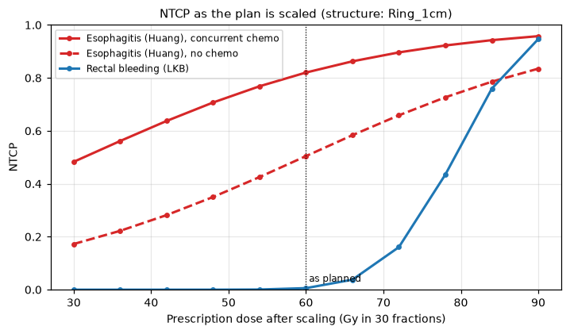
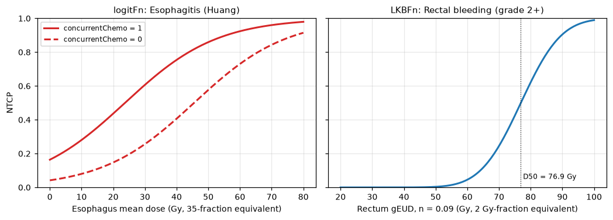

Radiotherapy outcomes modeling (ROE)
====================================

The :mod:`cerr.roe` package predicts the probability of a treatment outcome
from a dose distribution: normal tissue complication probability (NTCP) for an
organ at risk, or tumor control probability (TCP). It is the pyCERR
counterpart of CERR's Radiotherapy Outcomes Estimator.

A model is a small JSON file. It names the structures it needs, the
dose-volume metric to take from each, any clinical predictors, the published
coefficients and the functional form that combines them. pyCERR ships a
library of such files, and you can add your own without writing code.

Evaluating a model does four things:

1. Finds each structure the model names in ``planC`` and computes its DVH.
2. Converts the dose to the fractionation the model was fitted on.
3. Reduces each DVH to the metric the model asks for (mean dose, gEUD, ...).
4. Passes the metrics and clinical predictors to the model function.

Prerequisites
-------------

A ``planC`` with a dose and the structures the model names. The examples use
the bundled lung phantom with a synthetic 60 Gy dose and a 1 cm shell around
the GTV, ``Ring_1cm``, standing in for an organ at risk (built in
:doc:`../tutorials/end_to_end`). The probabilities below demonstrate the
mechanics and have no clinical meaning.

Minimal example
---------------

With clinical data whose structure names match the model, one call is enough:

.. code-block:: python

   from cerr.roe import dosimetric_models as roe

   ntcp = roe.run('Rectal bleeding (grade 2+)', doseNum, planC, fSizeIn=1.8)

``fSizeIn`` is the fraction size of the plan in Gy. Models that correct by
fraction number take ``fNumIn`` instead.

The model library
-----------------

.. code-block:: python

   print(roe.listModels())

.. list-table::
   :header-rows: 1
   :widths: 27 13 20 20 20

   * - Model name
     - Function
     - Structure: metric
     - Fractionation correction
     - Clinical predictors
   * - Bronchial stenosis (cox)
     - ``coxFn``
     - Bronchi: mean dose
     - none
     -
   * - Bronchial stenosis (logistic)
     - ``logitFn``
     - Bronchi: mean dose
     - none
     -
   * - Bronchial toxicity  (Grade 3+)
     - ``logitFn``
     - PBT: D0.1
     - to 2 Gy fractions, α/β = 3
     -
   * - Bronchial toxicity (Grade 5)
     - ``logitFn``
     - PBT_protocol: D0.1
     - to 2 Gy fractions, α/β = 3
     -
   * - Esophagitis (Huang)
     - ``logitFn``
     - Esophagus: mean dose
     - to 35 fractions, α/β = 10
     - concurrentChemo
   * - Esophagitis (Jackson_cox)
     - ``coxFn``
     - Esophagus: D3
     - to 2 Gy fractions, α/β = 10
     -
   * - Esophagitis (Jackson_logistic)
     - ``logitFn``
     - Esophagus: D3
     - to 2 Gy fractions, α/β = 10
     -
   * - Esophagitis (Wijsman)
     - ``logitFn``
     - Esophagus: mean dose
     - to 2 Gy fractions, α/β = 10
     - gender, concurrentChemo, tumorStage
   * - Pneumonitis (Appelt)
     - ``appeltLogit``
     - Lung_GTV: mean dose
     - to 35 fractions, α/β = 3
     - formerSmoker, currentSmoker, over63yrs, pulmonaryComorbidity,
       sequentialChemo, lowerMidLobe
   * - Rectal bleeding (grade 2+)
     - ``LKBFn``
     - Rectum: gEUD
     - to 2 Gy fractions, α/β = 3
     -
   * - Xerostomia (grade 2+)
     - ``logitFn``
     - SCRR, Parotids-SCRR, Submandibular glands, Oral cavity: mean dose
     - none
     - pretreatment_toxicity

The files live in ``cerr/roe/model_parameters``;
:func:`~cerr.roe.dosimetric_models.getModelDir` returns the path and
:func:`~cerr.roe.dosimetric_models.mapModelToFile` turns a model name into
its file. Note the two spaces in ``'Bronchial toxicity  (Grade 3+)'``.

Walkthrough
-----------

Load a model and map its structures
~~~~~~~~~~~~~~~~~~~~~~~~~~~~~~~~~~~

:func:`~cerr.roe.dosimetric_models.run` looks structures up by exact name. If
your contours are named differently, load the model as a dictionary and
rename the key. The same dictionary is where you supply clinical predictors,
which ship with ``"val": null`` and must be filled in.

.. code-block:: python

   import json

   with open(roe.mapModelToFile('Esophagitis (Huang)')) as f:
       model = json.load(f)

   structs = model['parameters']['structures']
   model['parameters']['structures'] = {'Ring_1cm': structs['Esophagus']}
   model['parameters']['concurrentChemo']['val'] = 1        # 0 = No, 1 = Yes

Evaluate it
~~~~~~~~~~~

.. code-block:: python

   doseNum = 0
   ntcp = roe.run(model, doseNum, planC, fNumIn=30)         # plan: 30 fractions
   print(round(ntcp, 4))

   model['parameters']['concurrentChemo']['val'] = 0
   print(round(roe.run(model, doseNum, planC, fNumIn=30), 4))

.. code-block:: text

   0.8203
   0.5046

:func:`~cerr.roe.dosimetric_models.run` accepts a model name, a path to a
JSON file or a dictionary. It raises ``ValueError`` listing any predictor
still set to ``null``.

Explore the dose response
~~~~~~~~~~~~~~~~~~~~~~~~~

A common question is how the risk changes if the plan is escalated or
de-escalated. Scale the dose, add it to ``planC`` as a new dose and evaluate
again:

.. code-block:: python

   import numpy as np
   from cerr import plan_container as pc

   xV, yV, zV = planC.dose[doseNum].getDoseXYZVals()
   dose3M = planC.dose[doseNum].doseArray

   scaleV = np.linspace(0.5, 1.5, 11)
   ntcpV = []
   for scale in scaleV:
       planC = pc.importDoseArray(dose3M * scale, xV, yV, zV, planC, 0)
       ntcpV.append(roe.run(model, len(planC.dose) - 1, planC, fNumIn=30))
       del planC.dose[-1]

   NTCP for ``Ring_1cm`` as the 60 Gy plan is scaled between 50% and 150%.
   The logistic model shifts with the chemotherapy predictor; the LKB model,
   driven by a gEUD with ``n = 0.09``, responds to the hottest part of the
   structure and rises steeply.

Evaluate from pre-computed predictors
~~~~~~~~~~~~~~~~~~~~~~~~~~~~~~~~~~~~~

When the dose metrics are already known, for example from a spreadsheet of
a cohort, :func:`~cerr.roe.dosimetric_models.runFromPredictors` needs no
``planC``. Dose metrics are keyed ``"<structure> <metric>"`` and must already
be corrected to the model's fractionation.

.. code-block:: python

   ntcp = roe.runFromPredictors('Esophagitis (Huang)',
                                {'Esophagus meanDose': 30.0, 'concurrentChemo': 1})
   print(round(ntcp, 4))

.. code-block:: text

   0.6068

Model file format
-----------------

.. code-block:: json

   {
     "name": "Esophagitis (Huang)",
     "type": "NTCP",
     "stdNumFractions": 35,
     "fractionCorrect": "Yes",
     "correctionType": "frxnum",
     "abRatio": 10,
     "parameters": {
       "structures": {
         "Esophagus": {
           "meanDose": {"val": "meanDose", "weight": 0.0688}
         }
       },
       "concurrentChemo": {"weight": 1.5, "val": null, "desc": {"No": 0, "Yes": 1}},
       "constant": {"weight": 1, "val": -3.13}
     },
     "function": "logitFn"
   }

.. list-table::
   :header-rows: 1
   :widths: 25 75

   * - Field
     - Meaning
   * - ``name``, ``type``
     - Display name and ``NTCP`` or ``TCP``.
   * - ``function``
     - The model function in :mod:`cerr.roe.dosimetric_models` to call.
   * - ``fractionCorrect``
     - ``"Yes"`` to convert the DVH with the linear-quadratic model first.
   * - ``correctionType``
     - ``"frxsize"`` converts to ``stdFractionSize`` Gy per fraction; pass
       ``fSizeIn`` to ``run``. ``"frxnum"`` converts to ``stdNumFractions``
       fractions; pass ``fNumIn``.
   * - ``abRatio``
     - α/β in Gy used for the conversion.
   * - ``parameters.structures``
     - One entry per structure, each mapping a metric to
       ``{"val": <metric>, ...}``. ``val`` names a DVH metric to compute, or
       holds a number to use as given. ``params`` passes extra arguments to
       the metric, such as the gEUD volume parameter ``n``.
   * - other ``parameters``
     - Model coefficients (``D50``, ``m``, ``constant``) and clinical
       predictors. A predictor has ``val`` (``null`` until supplied), a
       coefficient (``weight``, or ``OR`` for the Appelt model) and an
       optional ``desc`` documenting its coding.

The DVH metrics a model can request are ``meanDose``, ``minDose``,
``maxDose``, ``Dx``, ``Vx``, ``gEUD``, ``MOHx`` and ``MOCx``, all computed by
:mod:`cerr.dvh` (see :doc:`dvh`).

Model functions
---------------

.. list-table::
   :header-rows: 1
   :widths: 22 78

   * - Function
     - Form
   * - :func:`~cerr.roe.dosimetric_models.logitFn`
     - Logistic: :math:`1 / (1 + e^{-g})` with
       :math:`g = \sum_i w_i x_i` over all entries that have a ``weight``.
   * - :func:`~cerr.roe.dosimetric_models.LKBFn`
     - Lyman-Kutcher-Burman: :math:`\Phi\!\left(\frac{gEUD - D_{50}}{m\,D_{50}}\right)`
       with :math:`\Phi` the standard normal cumulative distribution.
   * - :func:`~cerr.roe.dosimetric_models.appeltLogit`
     - Logistic in mean dose with ``D50`` and ``gamma50`` adjusted by the
       odds ratios of clinical risk factors (Appelt et al., 2014).
   * - :func:`~cerr.roe.dosimetric_models.coxFn`
     - Cox proportional hazards, returning an actuarial probability.
   * - :func:`~cerr.roe.dosimetric_models.linearFn`
     - Linear: intercept plus weighted metrics.
   * - :func:`~cerr.roe.dosimetric_models.biexpFn`
     - Bi-exponential.
   * - :func:`~cerr.roe.dosimetric_models.lungBED`,
       :func:`~cerr.roe.dosimetric_models.lungTCP`
     - Lung tumor BED and TCP across fractionation schedules (Jeong et al.,
       2017).

   Dose-response of two built-in models. Left: ``logitFn``, with and without
   concurrent chemotherapy. Right: ``LKBFn``, which reaches 50% at
   ``D50 = 76.9`` Gy.

Adding your own model
---------------------

1. Copy the built-in file closest to your model from
   :func:`~cerr.roe.dosimetric_models.getModelDir`.
2. Edit the structure names, metrics, coefficients and fractionation fields.
3. Pass the path to :func:`~cerr.roe.dosimetric_models.run`. Any string
   containing ``.json`` is read as a file path.

.. code-block:: python

   ntcp = roe.run('/path/to/my_model.json', doseNum, planC, fSizeIn=2.0)

Check a new file against a hand calculation with
:func:`~cerr.roe.dosimetric_models.runFromPredictors` before using it on
patient data; ``tests/test_dosimetric_models.py`` shows the pattern used for
the built-in models.

Interactive explorer
--------------------

The ROE GUI plots NTCP and TCP against dose scale or fractionation for any
set of models, with a structure-mapping table and editable predictors. It
needs the ``viewer`` extra.

.. code-block:: python

   from cerr.roe.roe_gui import launch
   win = launch(planC)

See also
--------

* :doc:`dvh` for the dose-volume metrics the models consume.
* :doc:`segmentation` for the ``SCRR`` structures used by the xerostomia model.
* API reference: :doc:`../cerr.roe`.
* Figure script: ``docs/_figure_scripts/roe.py``.
