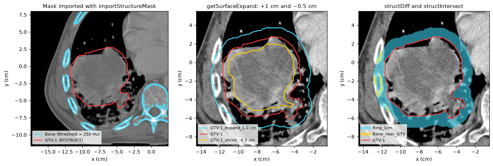
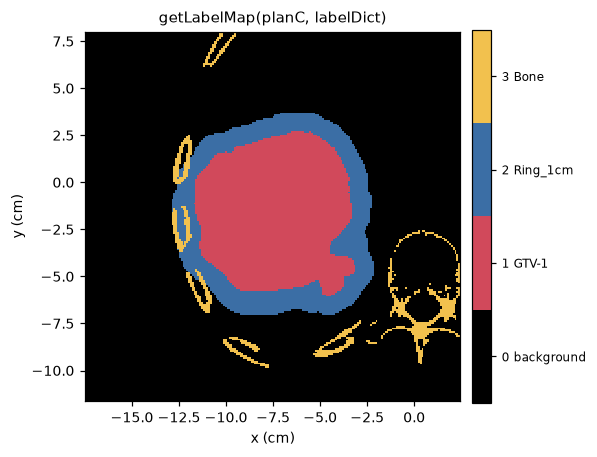

Segmentation and structures
===========================

A segmentation in pyCERR is a :class:`~cerr.dataclasses.structure.Structure`
in ``planC.structure``. It does not matter where it came from: an RTSTRUCT
drawn in a treatment planning system, a mask written by a deep-learning
model, or an array you computed. Once in ``planC`` it can be viewed, combined
with other structures, used for DVH and radiomics, and exported.

This page covers getting segmentations in, operating on them, running
pyCERR's segmentation models and getting results out.

Prerequisites
-------------

A ``planC`` with a scan. The examples use the bundled lung CT phantom, which
has one RTSTRUCT contour, ``GTV-1`` (see :doc:`../quickstart`).

Minimal example
---------------

.. code-block:: python

   from cerr import plan_container as pc
   from cerr.contour import rasterseg as rs

   mask3M = rs.getStrMask(0, planC)                        # structure -> bool array
   planC = pc.importStructureMask(mask3M, 0, 'GTV copy', planC)   # array -> structure

Getting segmentations into planC
--------------------------------

.. list-table::
   :header-rows: 1
   :widths: 30 70

   * - Source
     - How
   * - DICOM RTSTRUCT or SEG
     - Imported by :func:`~cerr.plan_container.loadDcmDir` with the scan.
   * - NIfTI mask or label map
     - :func:`~cerr.plan_container.loadNiiStructure`, with a dictionary
       naming each label: ``{'GTV_P': 1, 'GTV_N': 2}``.
   * - NumPy boolean array
     - :func:`~cerr.plan_container.importStructureMask`. The array must have
       the shape of the associated scan, ``(rows, cols, slices)``.
   * - JSON written by pyCERR
     - :func:`cerr.dataclasses.structure.importJson`

Importing an array is the bridge to any external algorithm. As an example,
segment bone by thresholding and keep the largest connected pieces:

.. code-block:: python

   from cerr.utils import mask as maskUtils

   scanNum = 0
   scan3M = planC.scan[scanNum].getScanArray()

   bone3M = maskUtils.largestConnComps(scan3M > 250, 8, minSize=500)
   planC = pc.importStructureMask(bone3M, scanNum, 'Bone', planC)

   print([s.structureName for s in planC.structure])

.. code-block:: text

   ['GTV-1', 'Bone']

To overwrite an existing structure in place, pass its index as
``structNum``.

Structure operations
--------------------

The functions in :mod:`cerr.dataclasses.structure` derive new structures from
existing ones. Each appends its result to ``planC.structure`` and returns the
updated ``planC``.

.. code-block:: python

   from cerr.dataclasses import structure as cerrStr

   gtvNum, boneNum = 0, 1

   planC = cerrStr.getSurfaceExpand(gtvNum, 1.0, planC)      # 2: GTV + 1 cm margin
   planC = cerrStr.getSurfaceExpand(gtvNum, -0.5, planC)     # 3: GTV - 0.5 cm
   planC = cerrStr.structDiff(2, gtvNum, planC, 'Ring_1cm')  # 4: shell around the GTV
   planC = cerrStr.structIntersect([2, boneNum], planC, 'Bone_near_GTV')   # 5
   planC = cerrStr.structUnion([gtvNum, boneNum], planC, 'GTV_or_bone')    # 6

.. code-block:: text

   0 GTV-1                     358.7 cc
   1 Bone                      210.9 cc
   2 GTV-1_expand_1.0 cm       715.3 cc
   3 GTV-1_shrink_-0.5 cm      197.8 cc
   4 Ring_1cm                  356.6 cc
   5 Bone_near_GTV               7.4 cc
   6 GTV_or_bone               569.5 cc

   Left: the thresholded ``Bone`` mask next to the RTSTRUCT ``GTV-1``.
   Centre: expansion by 1 cm and contraction by 0.5 cm. Right: ``Ring_1cm``
   (difference) and ``Bone_near_GTV`` (intersection).

.. list-table::
   :header-rows: 1
   :widths: 40 60

   * - Function
     - Result
   * - :func:`~cerr.dataclasses.structure.getSurfaceExpand`
     - Uniform margin in cm; negative values contract. ``restrict_2d=True``
       grows in-plane only.
   * - :func:`~cerr.dataclasses.structure.structUnion`,
       :func:`~cerr.dataclasses.structure.structIntersect`,
       :func:`~cerr.dataclasses.structure.structDiff`
     - Boolean combinations. Structures can be given by index or by name and
       must share a scan.
   * - :func:`~cerr.dataclasses.structure.getClosedMask`
     - Morphological closing and hole filling.
   * - :func:`~cerr.dataclasses.structure.getLargestConnComps`
     - Keeps the *N* largest connected components.
   * - :func:`~cerr.dataclasses.structure.getGaussianBlurredMask`,
       :func:`~cerr.dataclasses.structure.getBsplineSmoothing`
     - Smooths a jagged boundary.
   * - :func:`~cerr.dataclasses.structure.copyToScan`
     - Copies a structure onto another scan of the same ``planC``.

The closing, connected-component and Gaussian-blur functions return a mask and
add it to ``planC`` only when ``saveFlag=True``. They are the usual
post-processing for auto-segmentation output.

To compare contours of the same organ by several observers, and to build a
consensus contour with STAPLE,
:func:`cerr.contour.structure_consensus.createConsensusStructure` and
:func:`~cerr.contour.structure_consensus.compareStructures` report agreement
statistics; ``cerr/scripts/structure_consensus_example.py`` is a complete
example.

Label maps
----------

Deep-learning pipelines usually want one integer label map in place of many
binary masks. :func:`~cerr.dataclasses.structure.getLabelMap` builds it from
a name-to-label dictionary:

.. code-block:: python

   labelDict = {'GTV-1': 1, 'Ring_1cm': 2, 'Bone': 3}
   labelMap3M, structNumV = cerrStr.getLabelMap(planC, labelDict)

   print(labelMap3M.shape, labelMap3M.dtype)

.. code-block:: text

   (201, 204, 60) int64

   One slice of the label map. Where structures overlap, the one processed
   last wins; pass ``dim=4`` to get a stack of binary masks instead.

AI auto-segmentation
--------------------

:mod:`cerr.ai_models` installs and runs pretrained deep-learning segmentation
models from the CERR model library. Each model is installed with its own
Python environment, so its dependencies do not touch yours. pyCERR handles
the pre-processing the model expects, runs inference in a subprocess and
imports the output masks as structures.

.. note::

   The commands in this section were not executed when these pages were
   built, because they download model weights. Model numbers and required
   inputs depend on the installed version of ``model_installer``; use
   ``listModels`` and ``listInputs`` to see what applies to you.

Install the model manager once:

.. code-block:: bash

   pip install "model_installer @ git+https://github.com/cerr/model_installer.git"

List, install and inspect a model:

.. code-block:: python

   from cerr import ai_models
   from cerr.ai_models import install_utils, run_utils

   install_utils.listModels()                      # prints number and name of each model

   modelNum = 1
   installDir = '/path/to/models'
   ai_models.install(modelNum, installDir)         # weights + isolated environment

   run_utils.listInputs(modelNum, installDir)      # required and optional inputs

Run it. The inputs are passed as a dictionary; the bundled models take an
input location, an output location and a working directory:

.. code-block:: python

   userInputs = {'input_path': '/data/pt1/dicom',
                 'output_path': '/data/pt1/ai_output',
                 'session_path': '/data/pt1/session'}
   ai_models.run(modelNum, installDir, userInputs, verbose=True)

To attach the output of an earlier run to a ``planC`` you already hold:

.. code-block:: python

   planC = run_utils.importSeg(modelNum, installDir, '/data/pt1/ai_output',
                               scanNum, planC)

Models that need pre- or post-processing in pyCERR have scripts under
``cerr/ai_models/prep`` and ``cerr/ai_models/post``, which are the place to
look when adding a model. For your own pipelines,
:func:`cerr.utils.image_proc.resizeScanAndMask` crops, pads and resizes a
scan with its masks, and :mod:`cerr.utils.ai_pipeline` sets up session
directories and finds the scans derived from a given scan.

Rule-based segmentation models
------------------------------

:mod:`cerr.segmentation.models` holds segmentation methods that derive new
structures from existing ones without a neural network. Currently it provides
``'SCRR'``, which locates the stem-cell rich region of each parotid gland from
the parotid, masseter and mandible contours. The result feeds the
``Xerostomia (grade 2+)`` model in :doc:`roe`.

.. code-block:: python

   from cerr.segmentation import models

   paramDict = {'structNameDict': {'parotid': ['Left Parotid', 'Right Parotid'],
                                   'masseter': ['Left masseter', 'Right masseter'],
                                   'mandible': ['Mandible']}}
   mask4M, labelDict, planC = models.run('SCRR', planC, scanNum, paramDict)

``structNameDict`` maps each anatomical role to the names used in your
``planC``. The output structures are added to ``planC``, and ``mask4M`` holds
them as a stack with ``labelDict`` giving the index of each.

Contouring by hand
------------------

The desktop viewer (``pycerr[viewer]``) has a contouring tool under
*Tools > Contouring* for drawing and erasing structures on the axial view,
which is also the way to correct automatic results:

.. code-block:: python

   from cerr.viewer.pycerr_gui import show
   v = show(planC)

Exporting
---------

.. code-block:: python

   # One structure as a binary NIfTI mask
   planC.structure[4].saveNii('ring.nii.gz', planC)

   # Several structures as one label map
   pc.saveNiiStructure('labels.nii.gz', labelDict, planC, strNumV=[0, 4, 1])

   # DICOM RTSTRUCT, readable by treatment planning systems
   from cerr.dcm_export import rtstruct_iod
   rtstruct_iod.create([0, 4], 'rtstruct.dcm', planC,
                       {'seriesDescription': 'pyCERR structures'})

See also
--------

* :doc:`registration` to propagate structures between scans.
* :doc:`dvh` and :doc:`radiomics`, which take structures as input.
* API reference: :doc:`../cerr.dataclasses`, :doc:`../cerr.contour`.
* Figure script: ``docs/_figure_scripts/segmentation.py``.
